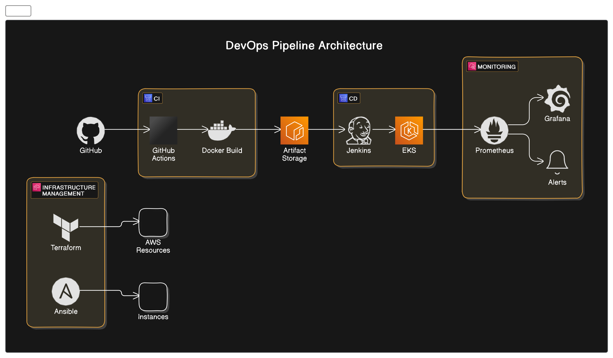

# DevOps Mastery Project

## Project Summary

This project demonstrates a comprehensive, end-to-end DevOps pipeline for a sample web application.
It showcases the implementation of modern DevOps practices and tools, focusing on automation,
continuous integration, continuous deployment, infrastructure as code, and monitoring.

The pipeline is designed to streamline the development process, ensure code quality, 
and enable rapid, reliable deployments.

## 1. Project Overview

### 1.1 Objective

The primary objective of this project is to create a robust, scalable, 
and automated DevOps pipeline that demonstrates proficiency in key DevOps tools and practices.
This pipeline will support the full lifecycle of a web application, 
from development to production deployment and monitoring.

### 1.2 Architecture & Scope 

The project scope encompasses:

1. Setting up a version control system for source code management
2. Implementing a CI/CD pipeline for automated testing and deployment
3. Utilizing infrastructure as code for provisioning and managing cloud resources
4. Containerizing the application and orchestrating it with Kubernetes
5. Implementing configuration management for consistent environment setup
6. Setting up comprehensive monitoring and observability solutions

### 1.3 Key Features

- Automated build and test processes
- Infrastructure provisioning using code
- Containerized application deployment
- Multi-environment support (development, staging, production)
- Automated deployment with zero downtime
- Real-time monitoring and alerting
- Scalable and fault-tolerant architecture

### 1.4 Technologies Used

- Version Control: **GitHub**
- CI/CD: **GitHub Actions**, **Jenkins**
- Infrastructure as Code: **Terraform**
- Configuration Management: **Ansible**
- Containerization: **Docker**
- Container Orchestration: Kubernetes (**Amazon EKS**)
- Monitoring and Observability: **Prometheus**, **Grafana**
- Cloud Provider: **AWS**

## 2. Pipeline Overview

The DevOps pipeline consists of the following stages:

1. **Code Commit**: Developers push code to GitHub repository
2. **Continuous Integration**: 
   - GitHub Actions triggers automated tests
   - Build Docker image
3. **Artifact Storage**: Push Docker image to Amazon ECR
4. **Continuous Deployment**:
   - Jenkins pulls the latest image
   - Deploy to Kubernetes cluster (EKS)
5. **Infrastructure Management**:
   - Terraform provisions and updates AWS resources
   - Ansible configures instances and applications
6. **Monitoring and Feedback**:
   - Prometheus collects metrics
   - Grafana visualizes performance data
   - Alerts sent for any issues

## 3. Benefits

- Faster time-to-market for new features
- Improved code quality through automated testing
- Consistent and reproducible environments
- Efficient resource utilization
- Rapid and reliable deployments
- Improved visibility into application and infrastructure performance

## 4. Success Criteria

- Successful implementation of the entire pipeline
- Ability to deploy code changes to production within 1 hour of commit
- Zero downtime during deployments
- Automated rollback in case of deployment failures
- Real-time monitoring with actionable alerts

## 5. Deliverables

1. Fully functional CI/CD pipeline
2. Infrastructure as Code scripts (Terraform)
3. Configuration management playbooks (Ansible)
4. Kubernetes deployment manifests
5. Monitoring dashboards and alert configurations
6. Comprehensive documentation including setup guide and architecture overview

This DevOps Pipeline Showcase Project demonstrates the ability to design, implement, and manage
a modern, cloud-native application lifecycle.